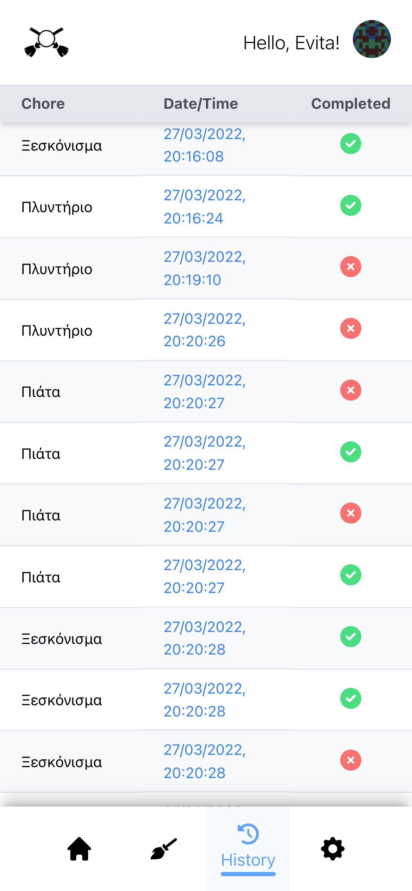
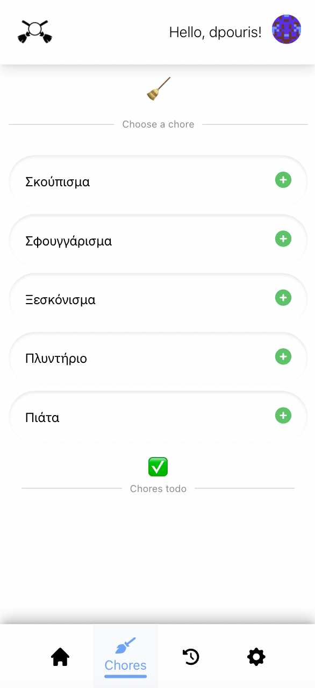
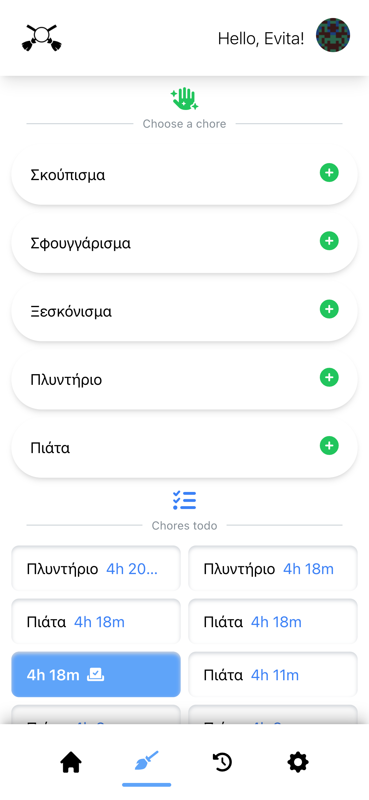

# Chore-Battle is an app that puts you against your friends and family and fight on who can do the most chores!

This is the initial build of the project and currently working on it to add more features.

To run the app do the following ->

1. CD into the chore_battle directory
   `cd chore-battle/backend/chore_battle`

2. Install the requirements from requirements.txt for the backend to run properly
   `pip install -r requirements.txt`

3. Make db migrations and migrate to create the tables and db.sqlite3 file
   `python manage.py makemigrations`

`python manage.py migrate`

4. Then run the createsuperuser command and add your info to create an admin user
   `python manage.py createsuperuser`

5. Finally run the server. It will open on port 8000 (http://localhost:8000/api/v1/)
   `python manage.py runserver`

# Moving on to the frontend

1. To start, CD into the frontend directory
   `cd chore-battle/frontend`

2. Then run npm i to install the package.json requirements for the frontend
   `npm i`

3. Finally run npm start to start the frontend server, it will open on port 3000 (http://localhost:3000/)
   `npm start`

And you're done!

# Screenshots

[]
[]
[]
