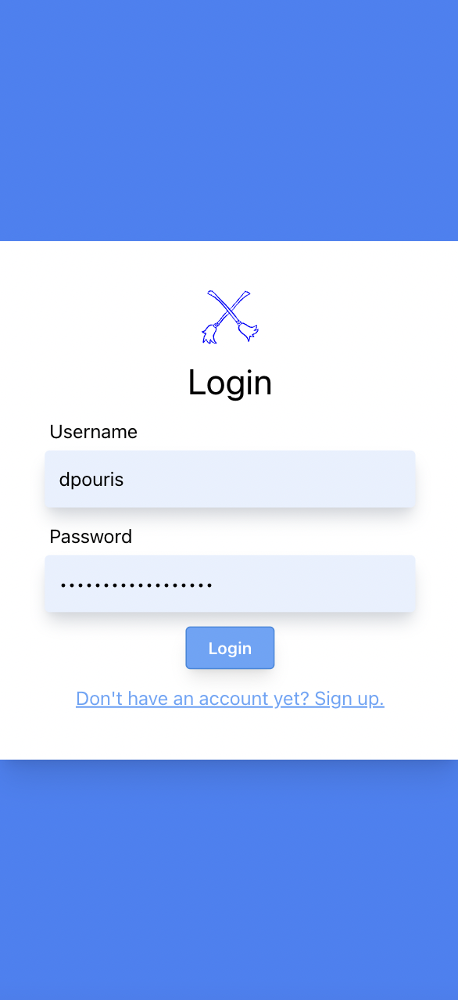
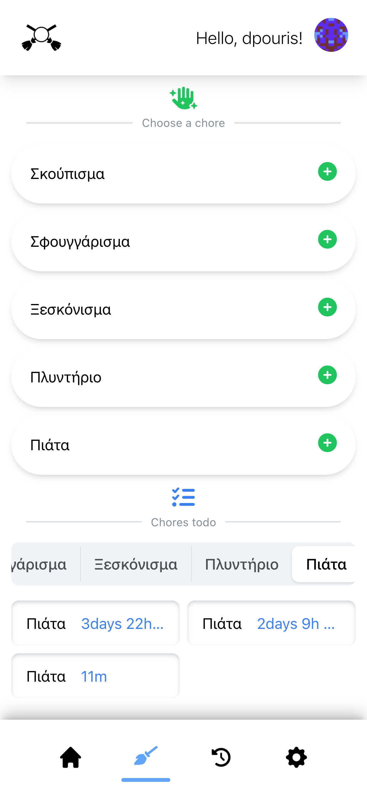
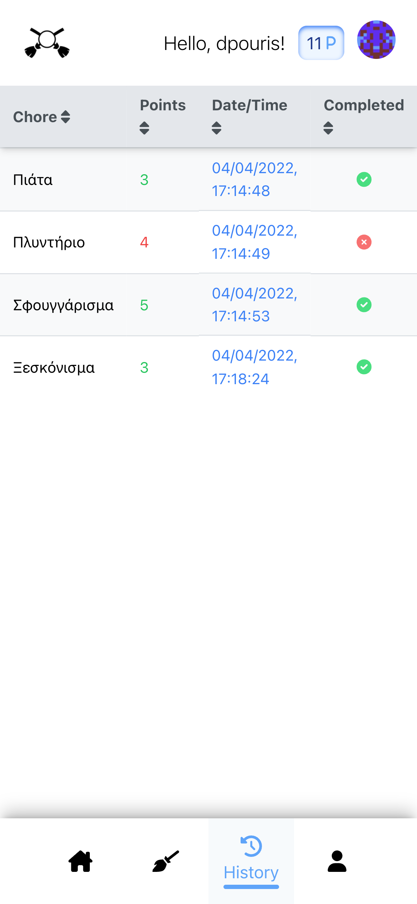
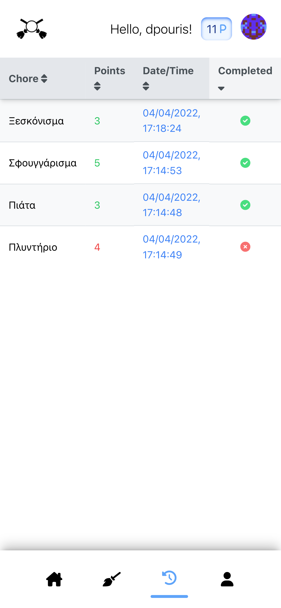

# Chore-Battle is an app that puts you against your friends and family to fight on who can do the most chores!

**The app is developed using React.js and Django and is currently in development.**

### To run the app do the following:

1. CD into the chore_battle directory

   `cd chore-battle/backend/chore_battle`

2. Install the requirements from requirements.txt for the backend to run properly

   `pip install -r requirements.txt`

3. Make db migrations and migrate to create the tables and db.sqlite3 file

   - `python manage.py makemigrations`

   - `python manage.py migrate`

4. Then run the createsuperuser command and add your info to create an admin user
   `python manage.py createsuperuser`

5. Finally run the server. It will open on port 8000 (http://localhost:8000/api/v1/)
   `python manage.py runserver`

# Moving on to the frontend

1. To start, `CD` into the root directory of the project where the backend and frontend folders are and run `npm i`

   - This is what the directory should look like if you type the `ls` command

   ```
   > ls
   ---
   LICENSE.txt       backend           package-lock.json
   README.md         frontend          package.json
   ```

   - Go ahead and install the dependencies

     `npm i`

2. Then, `CD` into the frontend directory

   `cd frontend/`

3. Then run `npm i` to install the package.json dependencies for the frontend

   `npm i`

4. Finally run `npm start` to start the frontend server, it will open on port 3000 (http://localhost:3000/)

   `npm start`

## And you're done!

---

# Screenshots

<!-- []
[]
[]
[] -->






