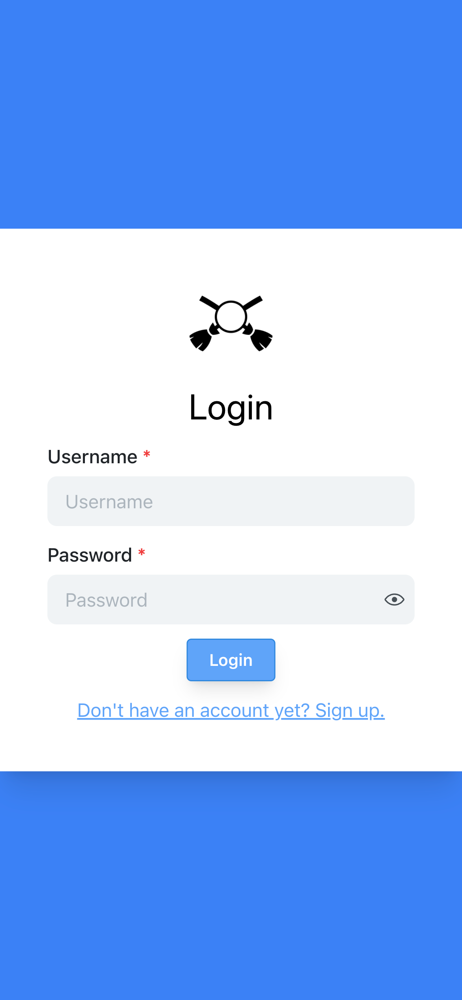
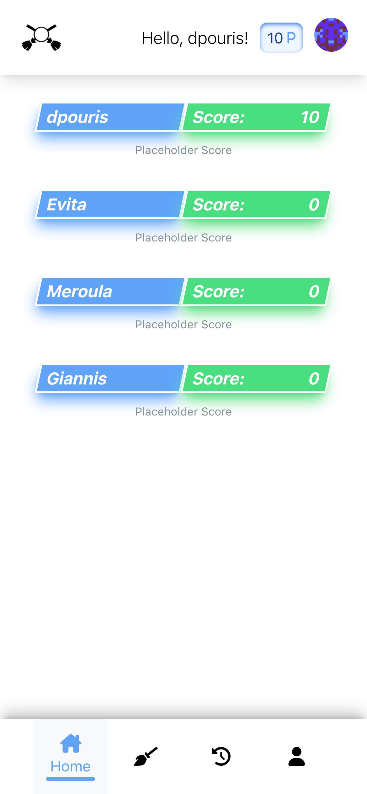
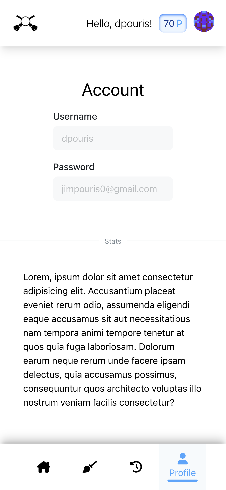

# Chore Battles is an app that puts you against your friends and family to fight on who can do the most chores!

**The app is currently being developed using React.js and Django.**

### To run the app do the following:

1. CD into the chore_battles directory

   `cd chore-battles`

2. Install the requirements from requirements.txt for the backend to run properly

   `pip install -r requirements.txt`

3. Make db migrations and migrate to create the tables and db.sqlite3 file

   - `python manage.py makemigrations`

   - `python manage.py migrate`

4. Then run the createsuperuser command and add your info to create an admin user

   `python manage.py createsuperuser`

5. Finally run the server. It will open on port 8000 (http://localhost:8000/api/v1/)

   `python manage.py runserver`

# Moving on to the frontend

1. To start, `CD` into the root directory of the project (If you're not already there) and run `npm i`

   - This is what the directory should look like if you type the `ls` command

   ```
   ❯ ls
   LICENSE.txt        manage.py          public
   README.md          node_modules       requirements.txt
   api                package-lock.json  src
   api_auth           package.json       tailwind.config.js
   chore_battle       postcss.config.js
   ```

   - Go ahead and install the dependencies

     `npm i`

2. Then, run `npm start` to start the frontend server, it will open on port 3000 (http://localhost:3000/)

   `npm start`

## And you're done!

---

# Screenshots

<!-- []
[]
[]
[] -->







